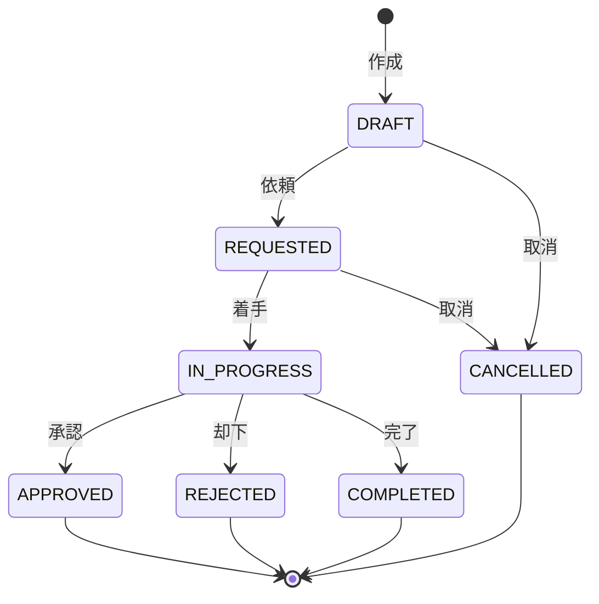
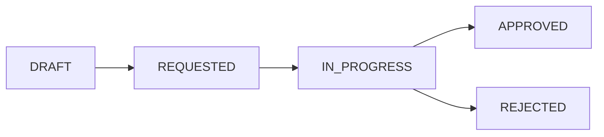
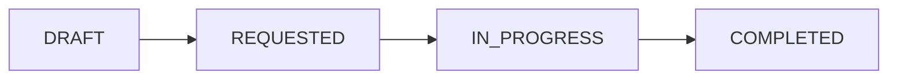

# TaskStateMachine - 状態遷移ルール

## 状態遷移図



## 遷移ルール一覧

| From | To | アクション | 条件 |
|------|-----|-----------|------|
| (new) | DRAFT | 作成 | なし |
| DRAFT | REQUESTED | 依頼 | 必須項目が入力済み |
| DRAFT | CANCELLED | 取消 | なし |
| REQUESTED | IN_PROGRESS | 着手 | 担当者が割り当て済み |
| REQUESTED | CANCELLED | 取消 | なし |
| IN_PROGRESS | APPROVED | 承認 | 承認系 Task のみ |
| IN_PROGRESS | REJECTED | 却下 | 承認系 Task のみ、理由必須 |
| IN_PROGRESS | COMPLETED | 完了 | 確認系 Task または承認後処理 |

## 巻き戻し不可ルール

**一度進んだ状態は戻せない。**

```
❌ 禁止される遷移
REQUESTED → DRAFT      （依頼を下書きに戻す）
IN_PROGRESS → REQUESTED （作業中を依頼済に戻す）
APPROVED → IN_PROGRESS  （承認済を作業中に戻す）
COMPLETED → IN_PROGRESS （完了を作業中に戻す）
```

### 理由

1. **監査証跡の保全**：状態変更履歴が正確に残る
2. **整合性の維持**：後続処理との不整合を防ぐ
3. **運用の明確化**：「やり直し」の曖昧さを排除

### 差し戻しが必要な場合

**新しい Task を作成する。**

```
Task A: REQUESTED → IN_PROGRESS → REJECTED（却下）
           ↓
Task B: DRAFT → REQUESTED → ...（修正して再依頼）
```

## 最終状態（Terminal State）

以下の状態になった Task は変更不可。

| 状態 | 意味 |
|------|------|
| APPROVED | 承認済（後続処理へ） |
| REJECTED | 却下（終了） |
| COMPLETED | 完了（終了） |
| CANCELLED | 取消（終了） |

## 用途別フロー

### 承認系 Task



例：契約承認、支払承認、変更承認

### 確認系 Task



例：書類確認、データチェック、作業完了報告

## 遷移の実装例

```kotlin
package nexus.common.task

object TaskStateMachine {

    private val transitions: Map<TaskStatus, Set<TaskStatus>> = mapOf(
        TaskStatus.DRAFT to setOf(TaskStatus.REQUESTED, TaskStatus.CANCELLED),
        TaskStatus.REQUESTED to setOf(TaskStatus.IN_PROGRESS, TaskStatus.CANCELLED),
        TaskStatus.IN_PROGRESS to setOf(TaskStatus.APPROVED, TaskStatus.REJECTED, TaskStatus.COMPLETED),
        TaskStatus.APPROVED to emptySet(),
        TaskStatus.REJECTED to emptySet(),
        TaskStatus.COMPLETED to emptySet(),
        TaskStatus.CANCELLED to emptySet()
    )

    fun canTransition(from: TaskStatus, to: TaskStatus): Boolean {
        return transitions[from]?.contains(to) ?: false
    }

    fun transition(from: TaskStatus, to: TaskStatus): TaskStatus {
        require(canTransition(from, to)) {
            "Invalid transition: $from -> $to"
        }
        return to
    }
}
```

## 禁止事項

| 禁止 | 理由 |
|------|------|
| 状態の巻き戻し | 監査証跡が壊れる |
| ドメイン固有の遷移ルール | ルールが分散する |
| 条件付き遷移の乱用 | 複雑化の原因 |
